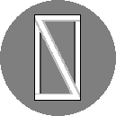

# NZG Software Launcher #
Programme to launch and manage all other NZG products.

> [!Note]
> If you just want to use the app, please see the 'Releases' tab on the right for stable builds, for more information see below.

The NSL (NatZombieGames Software Launcher) is an app made in Godot (4.4.1) which lets you discover, download, manage and update all the NZG games and software.

You can browse products in the Products page, and then open a certain products App page to view details, this is where you can download, manage, update and launch the product.
This app also features a tutorial and full theme / colour customization.

This app does not require a network connection for all functionality but many features do require a network connection.

> [!IMPORTANT]
> Certain products may require you to provide an API key to the app to fetch info from certain services, this includes:
> - [Itch](www.itch.io)
